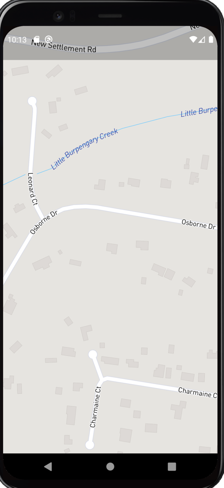

# flutter_mapbox_android_layout_bug

Minimum reproducible Android bug

This project contains the minimal code required to produce a layout issue on Android devices.

The layout is correct on iOS devices.

The behaviour on Android devices is to initially show the top layer (including the textbox, and mapbox attribution labels) before overwriting with the map view only.

As can be seen from the iOS (2nd image) the text box is displayed near the top of the screen.  This text box is not visible at the end of the layout process on Android.

